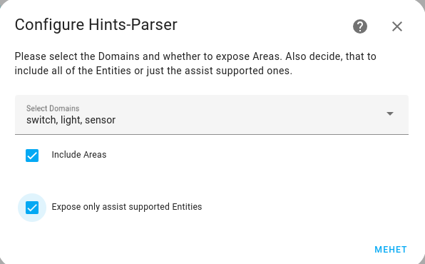

# HINTS-Parser Custom Component for Home Assistant

This custom component for Home Assistant allows you to parse all entities and their friendly names (and aliases) from your Home Assistant instance. The parsed entities are exposed via a RESTful API endpoint.

(HINTS: Home-assistant INtent Text Spell-checker)

# Installation
## Manual Installation

1. Copy the `hints_parser` directory into your `custom_components` directory.
2. Restart Home Assistant to load the custom component.
3. Add the HINTS-Parsar integration via ConfigFlow in the settings of HA


### HACS Installation
1. Open HACS Dashboard and add the following repository at custom repository submenu in the 3-dotted menu on top right corner: [https://github.com/cociweb/hacs-hints_parser](https://github.com/cociweb/hacs-hints_parser)
2. Search and Download HINTS Parser component with HACS
4. Restart Home Assistant
5. Add the HINTS-Parser integration via ConfigFlow in the settings of HA

## Usage

After the installation of the integration You need to create a [long-lived access token](https://community.home-assistant.io/t/how-to-get-long-lived-access-token/162159). With the Bearer Token authorization You are able to access a RESTful API endpoint at `/api/hints_parser`.

## Configuration




You can select which entity domains to include in the API by using the options flow for the `hints_parser` integration. The options flow presents a multi-select form where you can select one or more domain types.

With the help of the first checkbox (`Include Areas`), you can include the AREAs in the output.

With the second checkbox (`Expose only assist supported Entities`) You are able to filter the entities which are used by the assist module. - It significantly reduce the output and only returns the usable infos for assist.

## Output

The output is a json stream with 2 main (type: list) parts:
- entity
- area (optional)

### Example

```
{
    "entity": [
        {
            "id": "switch.switch",
            "name": null,
            "alter_name": "Switch",
            "aliases": null
        },
        {
            "id": "sensor.external_temp2",
            "name": "External Temp",
            "alter_name": "Alternative name derived from Device and Platform",
            "aliases": "Outside temperature|Ambient temperature|Air temperature"
        }

    ],
    "area": [
        {
            "id": "c43fb7b1a1bf4430a7d35f6b28824e09",
            "name": "Panicroom",
            "aliases": null
        },
        {
            "id": "Kitchen",
            "name": "Kitchen",
            "aliases": "Cookhouse|Kitchenette"
        }
    ]
}
```

### Description - API

#### Entity:

- id: is the id of the entity (including the domain and separated with a dot [.])
- name: is the (friendly) name of the entity. or null if it is not definied
- alter_name: original name of the entity. If it is not available, then tries to parse the name from the combination of Device (if available) and Platform. - It tries to reproduce the same logic as Assist defines the names by default. It is recommended only for fallback purposes.
- aliases: a list of aliases what you can define for the assist. Multiple aliases are separated with pipes [|].

#### area (optional)

- id: is the id of the area
- name: is the (friendly) name of the area. or null if it is not definied
- aliases: a list of aliases what you can define for the assist. Multiple aliases are separated with pipes [|].

### Description - Sensor

This integration creates a sensor after the succesful install and configuration. By default the `sensor.hints_parser` is initialized with the value of `initialized`. This value is also used after a restart.

After the first successfull API request you will get a list from the selected and the last requested domain types Eg.: `['switch', 'light', 'sensor']`

## Troubleshoot

If you get 404 error message on the API endpoint at `/api/hints_parser` then the integration is not installed properly and it is not setted up via the config flow. Try to add the HINTS-Parser integration again as it is described in the Install and the Configuration sections.

If you get 500 internal server error, try to reinstall the HINTS-Parser module with the latest stable release.

## Note

Please note that this custom component requires the `requests` and `json` Python packages. Make sure to these packages are installed in your Home Assistant environment before using this custom component.

## Support

For support, please refer to the Home Assistant community forums.